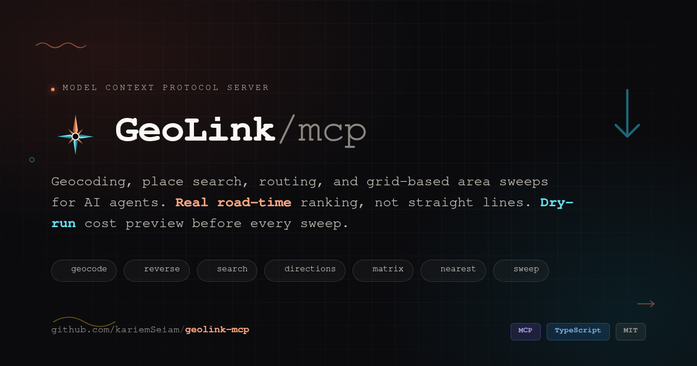

<div align="center">



# 🧭 GeoLink MCP

### Turn any AI agent into a location expert — geocoding, search, routing, and full-area sweeps over the Model Context Protocol

[](https://github.com/kariemSeiam/geolink-mcp/actions/workflows/ci.yml)
[](https://github.com/kariemSeiam/geolink-mcp/actions/workflows/codeql.yml)
[](https://www.npmjs.com/package/geolink-mcp)
[](https://github.com/kariemSeiam/geolink-mcp/blob/main/server.json)
[](https://smithery.ai)
[](LICENSE)
[](package.json)
[](tsconfig.json)
[](CONTRIBUTING.md)

**[Quickstart](#-quickstart) · [Tools](#-tools) · [Why](#-why-this-server-exists) · [Architecture](#-how-it-thinks) · [Prompts](#-prompts) · [Self-host](#-self-hosting) · [FAQ](#-faq)**

</div>

---

## ⚡ 60-second quickstart

You need Node.js ≥ 18 and a [free GeoLink API key](https://geolink-eg.com/register) — no credit card, sign up takes under a minute.

**1. Get a key** → [geolink-eg.com/register](https://geolink-eg.com/register)

**2. Add the server to your client:**

<table>
<tr><td><b>Claude Code</b></td><td>

```bash
claude mcp add geolink -e GEOLINK_API_KEY=your_api_key_here -- npx -y geolink-mcp
```

</td></tr>
<tr><td><b>Claude Desktop</b></td><td>

`claude_desktop_config.json`:

```json
{
  "mcpServers": {
    "geolink": {
      "command": "npx",
      "args": ["-y", "geolink-mcp"],
      "env": { "GEOLINK_API_KEY": "your_api_key_here" }
    }
  }
}
```

</td></tr>
<tr><td><b>Cursor / Windsurf / any stdio client</b></td><td>

Same shape: command `npx`, args `["-y", "geolink-mcp"]`, env `GEOLINK_API_KEY`.

</td></tr>
</table>

**3. Ask your agent something that needs a map:**

> *"What's the fastest way from Tahrir Square to Cairo Airport right now?"*
> *"Find every pharmacy within 3km of this address and rank them by real drive time."*
> *"Sweep this whole city for coffee shops — dry-run it first so I know the cost."*

That's it. No dashboards, no OAuth dance, no map SDK to wire up.

---

## 🤔 Why this server exists

Most geocoding MCP servers are thin 1:1 wrappers: one tool per endpoint, raw JSON dumped straight into context. That works until an agent asks for something an endpoint doesn't answer directly — *"which of these five branches is actually closest by road?"* or *"list every pharmacy in this district, not just the ten a single search call returns."*

GeoLink MCP is built the other way around: **agent-shaped answers first, endpoints second.**

| Instead of… | You get… |
|---|---|
| A search that quietly stops at one page | `geolink_search_places` pages to the depth you ask for and returns `source_exhausted`, so "no more results" is a fact you're told, not a guess |
| One `search` call returning one page from one point | `geolink_sweep_area` — tiles a whole region with a query grid, merges, de-duplicates, and groups results by district, with a `dry_run` that tells you the exact API cost *before* you spend it |
| Straight-line "nearest" that lies in cities with rivers, one-ways, and bridges | `geolink_find_nearest` — ranks candidates by **real road travel time**, not centimeters on a map |
| A wall of raw coordinate arrays for every route | `geolink_get_directions` with `route_detail` — summary by default, full polyline or sampled waypoints only when you ask, because geometry is 90% of the token cost and 10% of the value |
| Silent truncation or a stack trace | A structured error envelope — `Error (<kind>): <what happened>` + `Next step: <exactly what to change>` — so agents self-correct instead of retrying blind |

Every tool is read-only, every response validates against an explicit `outputSchema`, and every list respects a hard token ceiling with an honest truncation message instead of quietly dropping data.

---

## 🛠 Tools

All seven tools accept `language` / `country` / `response_format` (`markdown` or `json`) and return machine-readable `structuredContent`. Any parameter documented as a *location* accepts **either** coordinates (`"lat,lng"` or `{lat, lng}`) **or** a place name — names are geocoded automatically and cached in-process for 10 minutes.

| Tool | What it answers | Upstream calls |
|---|---|---|
| 🔎 `geolink_geocode` | "Where is *this address*?" → one place, structured `address_parts`, viewport bounds | 1 |
| 📍 `geolink_reverse_geocode` | "What's *at these coordinates*?" → address with `address_parts` | 1 |
| 🗺️ `geolink_search_places` | "Find *category/brand* near *here*" → as deep as `limit` asks, sorted by distance | ceil(limit/20) (+1 if `near` is a name) |
| 🛣️ `geolink_get_directions` | "How do I get from *A* to *B*?" → alternatives, geometry opt-in | 1 (+1 per named endpoint) |
| 🧮 `geolink_distance_matrix` | "Travel time between *these N* and *those M*?" → grid + nearest-per-origin | 1 (+1 per named location) |
| 🎯 `geolink_find_nearest` | "Which of these is *really* closest by road?" → ranked by real duration | 1 matrix (+1 search in discovery mode) |
| 🕸️ `geolink_sweep_area` | "Find *everything* of this kind in *this region*" → grid-tiled, de-duplicated, `dry_run` first | grid points × ceil(results_per_point/20) |

<details>
<summary><b>🛣️ <code>geolink_get_directions</code> — geometry is opt-in, not automatic</b></summary>

<br>

GeoLink's directions endpoint returns several route alternatives, each with a full waypoint path — hundreds of coordinate pairs. Dumping that straight into a model's context is mostly wasted tokens, so `route_detail` controls exactly how much geometry comes back:

| `route_detail` | Returns | Use for |
|---|---|---|
| `summary` *(default)* | distance, duration, endpoints, bounds, `waypoint_count` | ETAs, comparisons, planning |
| `polyline` | summary + Google-encoded polyline (precision 5) | drawing on a map — ~10× smaller than raw points |
| `waypoints` | summary + `[lat,lng][]`, evenly sampled to `max_waypoints` | when you genuinely need the coordinates |

It also returns `straight_line_km` so an agent can sanity-check detour ratios, and silently repairs bounding boxes whose NE/SW corners arrive swapped upstream.

</details>

<details>
<summary><b>🎯 <code>geolink_find_nearest</code> — two modes, one ranking</b></summary>

<br>

```text
# Mode 1 — you already know the candidates
origin = "customer address" or "30.05,31.23"
candidates = ["Branch A", "30.10,31.30", ...]

# Mode 2 — let it discover candidates near the origin
search_query = "pharmacy"
candidate_limit = 10

rank_by = "duration" | "distance"
```

Mode 2 searches near the origin, keeps the `candidate_limit` closest by straight line as a pre-filter, then routes all of them in a **single matrix call** and re-ranks by real travel time. Results flag `is_geolink_nearest` when the winner also matches GeoLink's own `nearest_destination_index` — a free sanity check.

</details>

<details>
<summary><b>🕸️ <code>geolink_sweep_area</code> — exhaustive coverage, cost known upfront</b></summary>

<br>

A single search returns one page from one center point. To find *everything* of a kind across a region, sweep tiles the area with a grid and merges:

1. **Resolve** the area to bounds — `{place: "..."}` via geocode viewport, `{center, radius_km}`, or raw `{bounds}` — optionally padded by `padding_km`.
2. **Tile** it with a square grid, one query point per `grid_spacing_km × grid_spacing_km` cell (longitude corrected for latitude; circular areas drop the corner points).
3. **Search** once per grid point with bounded concurrency — individual point failures are tolerated, auth/quota errors abort the whole sweep immediately.
4. **Clip** results to the area boundary, **de-duplicate** (same normalized name within `dedupe_meters`, script-aware — tashkeel stripped, alef/ta-marbuta/alef-maqsura folded for Arabic), and **group** by `governorate` and `district`.
5. **Shape** the output — page with `limit`/`offset`, trim fields with `fields`, or emit a ready-to-render GeoJSON `FeatureCollection`.

> **Always run `dry_run: true` first.** It returns the exact grid size and call count without touching the search endpoint — no surprise bills, no wasted quota. If the grid exceeds `GEOLINK_SWEEP_MAX_POINTS`, the error message tells you the smallest `grid_spacing_km` that fits.

**Spacing cheatsheet:** dense urban categories (pharmacies, cafés) → 2–3 km. Sparse categories or rural areas → 5–7 km. Clients that pass a `progressToken` get live `notifications/progress` as each grid point completes.

</details>

---

## 🧠 How it thinks

```
                    ┌─────────────────────────────────────────┐
                    │              MCP Client                 │
                    │   (Claude, Cursor, any agent runtime)    │
                    └───────────────────┬───────────────────┘
                                        │  stdio / streamable-http
                    ┌───────────────────▼───────────────────┐
                    │              GeoLink MCP                │
                    │                                          │
    ┌───────────────┼─────────────┬─────────────┬────────────┼───────────────┐
    │               │             │             │            │               │
┌───▼────┐   ┌──────▼─────┐  ┌────▼────┐  ┌─────▼─────┐  ┌───▼────┐   ┌──────▼──────┐
│geocode │   │search_places│  │directions│  │  matrix   │  │nearest │   │ sweep_area  │
│reverse │   │             │  │          │  │           │  │(composite)│ │(composite) │
└───┬────┘   └──────┬─────┘  └────┬────┘  └─────┬─────┘  └───┬────┘   └──────┬──────┘
    │               │             │             │            │               │
    └───────────────┴─────────────┴──────┬──────┴────────────┴───────────────┘
                                          │
                              ┌───────────▼────────────┐
                              │   normalize + cache      │   ← one envelope in,
                              │  (10-min geocode cache)  │      one shape out
                              └───────────┬────────────┘
                                          │
                                  ┌───────▼────────┐
                                  │   GeoLink API    │
                                  │ geolink-eg.com   │
                                  └─────────────────┘
```

**Design principles, not slogans:**

- **One response envelope in, one out.** GeoLink's `{success, data}` / `{success, error}` shape is normalized exactly once, in the client. Tools never see raw upstream payloads, and every field is defaulted — `outputSchema` validation can't fail on a sparse response.
- **Token budget is a first-class constraint, not an afterthought.** Route geometry is opt-in, matrix grids can collapse to nearest-only, sweep results page and field-trim, and every list response respects a 25,000-character ceiling with an explicit truncation message instead of silent data loss.
- **No hardcoded region.** GeoLink's own coverage leads in Egypt today, but `language` / `country` are just optional bias parameters — everything works with coordinates or place names anywhere GeoLink resolves them, in any language it supports.
- **No fabricated data, ever.** Bounds, districts, and addresses always come live from GeoLink's geocoder. Nothing in this server is a static local list pretending to be current.
- **Errors that teach.** Every failure returns in-band as `Error (<kind>): <what happened>` — `Next step: <the exact parameter change that fixes it>`. An agent that hits a matrix-too-big error learns the batch size it needs, not just that something broke.
- **Sessions that clean up after themselves.** HTTP mode keeps one MCP session per client, as the protocol expects, and reaps any session left idle for 30 minutes — a client that disappears without saying goodbye can't leak a session for the life of the process. stdio mode never writes anything but protocol frames to stdout.

---

## 💬 Prompts

Three ready-made prompt templates drive multi-step workflows without you having to script the tool sequencing yourself:

| Prompt | Arguments | Drives |
|---|---|---|
| `geolink_coverage_report` | `category`, `area` | dry-run → tune spacing → sweep → per-district summary with gap analysis |
| `geolink_nearest_branch` | `customer_location`, `branches` | `find_nearest` + recommendation, flags when straight-line and road-time disagree |
| `geolink_route_brief` | `origin`, `destination` | directions with polyline + detour-ratio sanity check |
| `geolink_coverage_audit` | `category`, `area` | sweep, then test the result for saturation, overlap and edge loss before reporting a number |
| `geolink_service_gap` | `service`, `demand_proxy`, `area` | two comparable sweeps → demand-versus-supply ranking → drive time to the nearest existing one |

## 📚 Resources

| URI | Contents |
|---|---|
| `geolink://playbook` | Which tool answers which question, and the distinction that causes most wrong answers: depth reads one center deeper, a sweep reads new ground |
| `geolink://playbook/coverage` | The three ways area coverage silently fails — saturated cells, edges outside the geocoded viewport, spacing wider than each search's reach — and the test for each |
| `geolink://playbook/recipes` | Compositions across several tools: reachable-area approximation, territory assignment, underserved-ground analysis, on-the-way search, address-confidence checks |
| `geolink://scale` | Measured call counts, latency and response variance, with the planning rules that follow from them |
| `geolink://capabilities` | Endpoints, defaults, cost formulas, the two guard rails that can refuse a request, and every error kind |

The playbook travels over the protocol rather than as a file, so it reaches any
client — an IDE agent, a chat model, a harness with no filesystem — without
anything to install.

---

## 🔧 Configuration

| Variable | Default | Notes |
|---|---|---|
| `GEOLINK_API_KEY` | — | **Required.** [Free tier, no card.](https://geolink-eg.com/register) Passed to GeoLink as the `key` query parameter — never logged, never echoed in output. |
| `GEOLINK_BASE_URL` | `https://www.geolink-eg.com` | Override for staging or the bundled mock server. |
| `GEOLINK_DEFAULT_LANGUAGE` | `en` | Any tool call can override with `language`. |
| `GEOLINK_DEFAULT_COUNTRY` | *(none)* | Any tool call can override with `country`; unset means no bias. |
| `GEOLINK_TIMEOUT_MS` | `30000` | Per upstream request. |
| `GEOLINK_MAX_MATRIX_CELLS` | `100` | `origins × destinations` cap for matrix tools. |
| `GEOLINK_SWEEP_MAX_POINTS` | `200` | Max grid points (= max API calls) per sweep. |
| `GEOLINK_SWEEP_CONCURRENCY` | `4` | Parallel requests during a sweep. |
| `TRANSPORT` | `stdio` | `stdio` or `http`. |
| `HOST` / `PORT` | `127.0.0.1` / `3000` | HTTP transport only. |

## 🖥 Self-hosting

<details>
<summary><b>From source</b></summary>

```bash
git clone https://github.com/kariemSeiam/geolink-mcp
cd geolink-mcp
npm install && npm run build
GEOLINK_API_KEY=... node dist/index.js
```

</details>

<details>
<summary><b>Remote — Streamable HTTP</b></summary>

```bash
GEOLINK_API_KEY=... TRANSPORT=http PORT=3000 node dist/index.js
# → POST http://127.0.0.1:3000/mcp   (stateless JSON; GET /healthz for liveness)
```

Binds to `127.0.0.1` by default. Set `HOST=0.0.0.0` only behind a reverse proxy that handles auth and `Origin` validation.

</details>

<details>
<summary><b>Docker</b></summary>

```bash
docker compose up -d --build
curl http://127.0.0.1:3010/healthz
```

`docker-compose.yml` builds the image, sets `TRANSPORT=http`, and binds `127.0.0.1:3010` with a healthcheck baked in. Set `GEOLINK_API_KEY` in a local `.env` (see `.env.example`) before starting.

</details>

## 🚨 Errors

Every failure returns in-band (`isError: true`) as `Error (<kind>): <what happened>` + `Next step: <what to do about it>`.

`auth` · `quota` · `not_found` · `bad_request` · `timeout` · `network` · `upstream`

Guard-rail errors — a matrix over its cell cap, a sweep grid over its point cap — always include the exact parameter change that would succeed, so an agent can retry correctly on the first try.

## 🧪 Development

```bash
npm install
npm run build          # tsc → dist/
npm test               # unit tests: grid math, polyline (Google reference vector), dedup, normalizers
npm run test:e2e       # real MCP client ↔ server ↔ mock GeoLink, 29 checks, zero network needed
npm run inspect        # MCP Inspector against dist/index.js
bash scripts/smoke.sh  # HTTP transport, auth-failure path, startup validation, CLI flags
```

`scripts/mock-geolink.mjs` mirrors the documented response shapes — including deliberately swapped bounds and an out-of-area result — so the full test suite runs offline, deterministically, in CI.

## 🧬 Extending

GeoLink occasionally adds fields (website, phone, category, rating…) or raises per-query result counts. There are exactly **four** places to touch:

0. If the change is about *how many* results a search returns rather than a new field, it lives in one place: the `maxResults` argument of `client.textSearch` (`src/services/client.ts`) and the `UPSTREAM_PAGE_SIZE` / `MAX_SEARCH_DEPTH` constants it reads.
1. Add the raw field to `RawPlace` in `src/types.ts` and the clean field to `Place`.
2. Map it in `normalizePlace` (`src/services/normalize.ts`) with a safe default.
3. Add it to `PlaceSchema` (`src/services/schemas.ts`) and, if it should be trimmable, to the `fields` enum in `src/tools/sweep.ts`.
4. Render it in `placeMarkdown` (`src/services/format.ts`).

Nothing else changes — every tool flows through those four points. Details and a PR checklist live in [CONTRIBUTING.md](CONTRIBUTING.md).

---

## ❓ FAQ

<details>
<summary><b>Is the API key really free?</b></summary>
<br>
Yes — <a href="https://geolink-eg.com/register">register at geolink-eg.com</a>, no credit card required. Keys are provisioned instantly.
</details>

<details>
<summary><b>Does this only work in Egypt?</b></summary>
<br>
The server has no hardcoded region — <code>language</code> and <code>country</code> are optional bias parameters, and coordinates work everywhere. GeoLink's own data coverage is strongest in Egypt today; results elsewhere depend on GeoLink's upstream coverage for that area.
</details>

<details>
<summary><b>Why not just call the GeoLink REST API directly from my agent framework?</b></summary>
<br>
You can — but you'd be re-implementing grid sweeps, road-time ranking, geometry budgeting, retry-worthy error messages, and response-shape normalization yourself. This server does that once, tested, so every MCP client gets it for free.
</details>

<details>
<summary><b>Can I run this without exposing my API key to the client machine?</b></summary>
<br>
Yes — run it in <code>TRANSPORT=http</code> mode on a server you control (see <a href="#-self-hosting">Self-hosting</a>), put it behind a reverse proxy that handles auth, and point your MCP client at the HTTP endpoint instead of spawning a local stdio process.
</details>

<details>
<summary><b>What happens if a sweep is too expensive?</b></summary>
<br>
It never runs. <code>dry_run: true</code> computes the exact grid size and call count with zero upstream search calls. If the grid exceeds <code>GEOLINK_SWEEP_MAX_POINTS</code>, the tool refuses and tells you the smallest <code>grid_spacing_km</code> that would fit under the cap.
</details>

---

<div align="center">

**[Contributing](CONTRIBUTING.md)** · **[Security](SECURITY.md)** · **[Changelog](CHANGELOG.md)** · **[Code of Conduct](CODE_OF_CONDUCT.md)** · **[MIT License](LICENSE)**

Built on [GeoLink](https://geolink-eg.com) · Speaks [Model Context Protocol](https://modelcontextprotocol.io)

</div>
